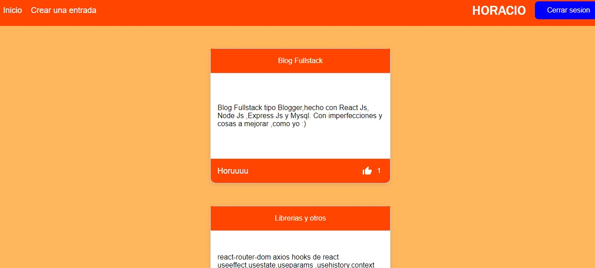
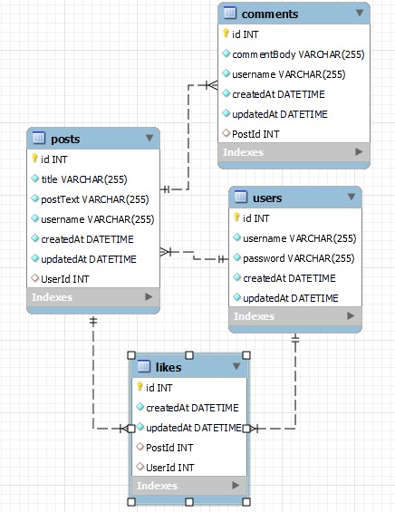

# Blog-Fullstack
React+Node+Express+Mysql

Apis construidas con Node Js y Express . Con Sequelize compatible con Mysql y Sqlite

Web App hecha con React Js

Caracteristicas:
<ul>
<li >Crea entradas,las edita , las elimina y las guarda en base de datos</li>
<li>Tambien edita el titulo y  el contenido de los posteos.Se pueden eliminar.</li>
<li>Sistema de autenticación con Jason Web Token.</li>
<li>Login y registro.También puede actualizar la contraseña</li>
<li>Permite al usuario  darle like a las entradas y guardarlos en la db.</li>
<li>Comentar los posteos y borrar el comentario del mismo usuario</li>
<li>Página individual del perfil del usuario</li>
</ul>
Librerias usadas y más:

React-Router-Dom para las rutas a las diferentes páginas.

Axios para peticiones a apis.

Hooks de React useEffect,useState,useParams ,useHistory,Context Api.

Formik para  los  formularios y Yup para la validación. 

Bcrypt para el hash de los passwords.

Iconos de MaterialUI

Diagrama de base de datos:

Dentro de la carpeta server ,en config ,cambiar dialecto y la contraseña,también está el archivo sql con base de datos completa,  sino con la conexión establecida sequelize genera toda la base de datos.
<footer>Para ejecutar desde el directorio server npm start y desde el directorio client  yarn start.</footer>

